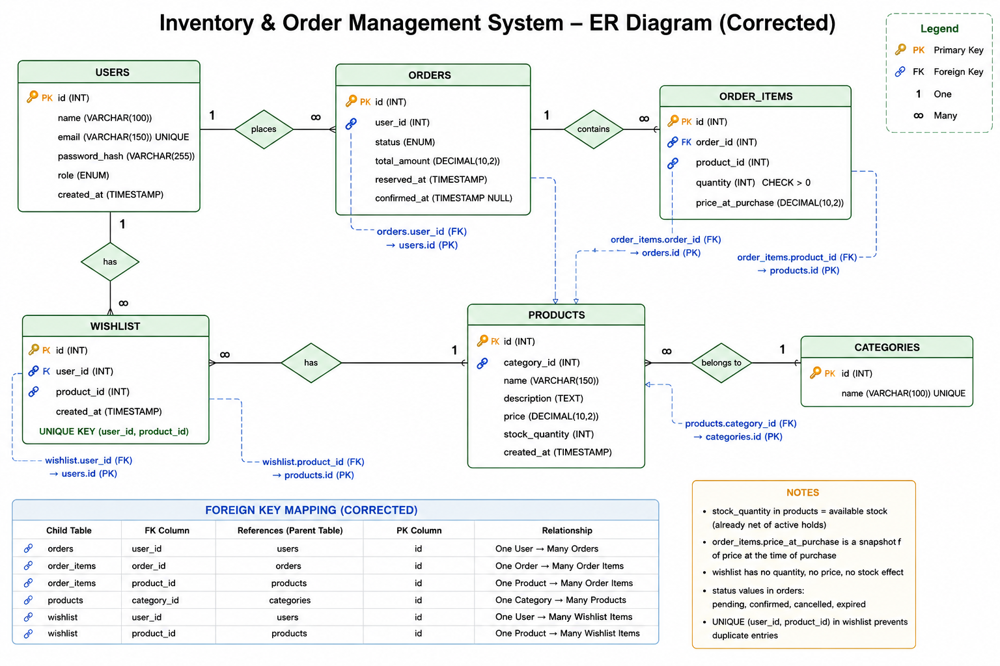

# Inventory Order Management System - Backend

This project is the backend service for the Inventory Order Management System. It provides REST APIs for user authentication, product management, category management, wishlist, and order management.

The application is built using Node.js, Express.js, MySQL, and JWT Authentication.

---

## API Base URL

https://endearing-learning-production-acc0.up.railway.app/api

---

## Database

The complete database resources are available inside the `database` folder.

Contents:

- Inventory_Order_System.sql
- ER_Diagram.png
- Database_Schema.png

These files can be used to recreate the database and understand the relationships between tables.



## Features

### Authentication

- User Registration
- User Login
- JWT Authentication
- Password Hashing using bcrypt
- Protected Routes
- Role-based Authorization

### Products

- Get all products
- Get product by ID
- Add product (Admin)
- Update product (Admin)
- Delete product (Admin)

### Categories

- Get all categories
- Add category (Admin)
- Update category (Admin)
- Delete category (Admin)

### Wishlist

- Add product to wishlist
- View logged-in user's wishlist

### Orders

- Create Order
- View logged-in user's orders
- View all orders (Admin)
- Cancel Order
- Confirm Order (Admin)

---

## Tech Stack

- Node.js
- Express.js
- MySQL
- JWT
- bcrypt
- dotenv
- cors

---

## Project Structure

```
backend
│
├── config
├── controller
├── middleware
├── models
├── routes
├── utils
├── server.js
└── package.json
```

---

## Authentication Flow

```
Register
      ↓
Customer Account Created
      ↓
Login
      ↓
JWT Generated
      ↓
Authorization Header
      ↓
Protected APIs
```

---

## API Endpoints

### Authentication

| Method | Endpoint |
|---------|----------|
| POST | /api/auth/register |
| POST | /api/auth/login |

---

### Products

| Method | Endpoint |
|---------|----------|
| GET | /api/products |
| GET | /api/products/:id |
| POST | /api/products |
| PUT | /api/products/:id |
| DELETE | /api/products/:id |

---

### Categories

| Method | Endpoint |
|---------|----------|
| GET | /api/categories |
| POST | /api/categories |
| PUT | /api/categories/:id |
| DELETE | /api/categories/:id |

---

### Wishlist

| Method | Endpoint |
|---------|----------|
| POST | /api/wishlist |
| GET | /api/wishlist |

---

### Orders

| Method | Endpoint |
|---------|----------|
| POST | /api/orders |
| GET | /api/orders/my |
| GET | /api/orders |
| PUT | /api/orders/:id/cancel |
| PUT | /api/orders/:id/confirm |

---

## Installation

Clone the repository

```bash
git clone https://github.com/guru6304/inventory-order-system-backend.git
```

Move into the project

```bash
cd inventory-order-system-backend
```

Install dependencies

```bash
npm install
```

Create a `.env` file and configure the required environment variables.

Start the server

```bash
npm start
```

or

```bash
npm run dev
```

---

## Environment Variables

Create a `.env` file with the following values:

```env
PORT=5000

DB_HOST=localhost
DB_USER=your_username
DB_PASSWORD=your_password
DB_NAME=inventory_order_system

JWT_SECRET=your_secret_key
```

---

## Security

- Passwords are hashed using bcrypt.
- JWT is used for authentication.
- Protected routes use middleware.
- Role-based authorization is implemented for admin operations.
- New users are registered as **customers** by default. Admin accounts are created by updating the user's role in the database or through an admin management process.

---

## Future Improvements

- Product search
- Pagination
- Image upload
- Payment integration
- Email notifications
- Order tracking
- Dashboard analytics

---


## API Validation Images

The `ValidationImages` folder contains screenshots captured while testing the backend REST APIs using **Postman**.

These screenshots demonstrate that each endpoint was tested successfully during development.

### Included API Tests

#### Authentication

-Registration as Customer and Admin
-Login as Customer and Admin
-Invalid Login Handling
-JWT Authentication
-Get All Products
-Product Not Found.


## Author

Developed by **Guru**

GitHub:
https://github.com/guru6304